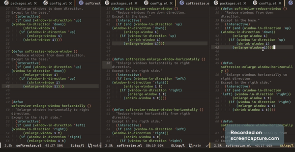

# softresize

softresize give us four functions to handle the sizing of windows. The reference in all windows (except for the windows in the borders down and right) are the mode-line (the base bar) and the right column. So `enlarge-window` will move the mode-line of the current buffer upwards, and `reduce-window` will move it downwards. Similar behavior will occur for horizontal resize.


## Instalation
Clone this repo in local and add the load path to Emacs init fie.


### For newcomers
I'm doing this because I remember me, when I was just starting to use Emacs ;)

1. First you have to clone this repo in your local machine because it is not in MELPA or any other package archive.
2. Add load path to your init file `(add-to-list 'load-path "/path/to/cloned/repository/softresize")`.
3. Next, add the code in Optional configuration to your init file.
### If Doom Emacs

If you are using doom Emacs, you can paste this code to package.el file.

``` emacs-lisp
(package! softresize
 :recipe (:host github :repo "jdburgosr/softresize"))
```

And then paste the code in Optional configuration in your config.el file ☺.

## Optional configuration

``` emacs-lisp
(require 'softresize)
(global-set-key (kbd "C-s-<up>") 'softresize-enlarge-window)
(global-set-key (kbd "C-s-<down>") 'softresize-reduce-window)
(global-set-key (kbd "C-s-<right>") 'softresize-enlarge-window-horizontally)
(global-set-key (kbd "C-s-<left>") 'softresize-reduce-window-horizontally)

```
### Note:
`C-s` mean Control-Super key. In Windows, Super Key is the key with the windows Logo on keyboard.


## Demonstration



# Developing

There is other four function to manage of deleting windows next to current window. In my personal configuration I move between windows with `M-arrow`, so I configure this functions in my init.et to be called with `M-S-arrow`. In this moment that functions are quite primitive because my Elisp knowledge, but work.
